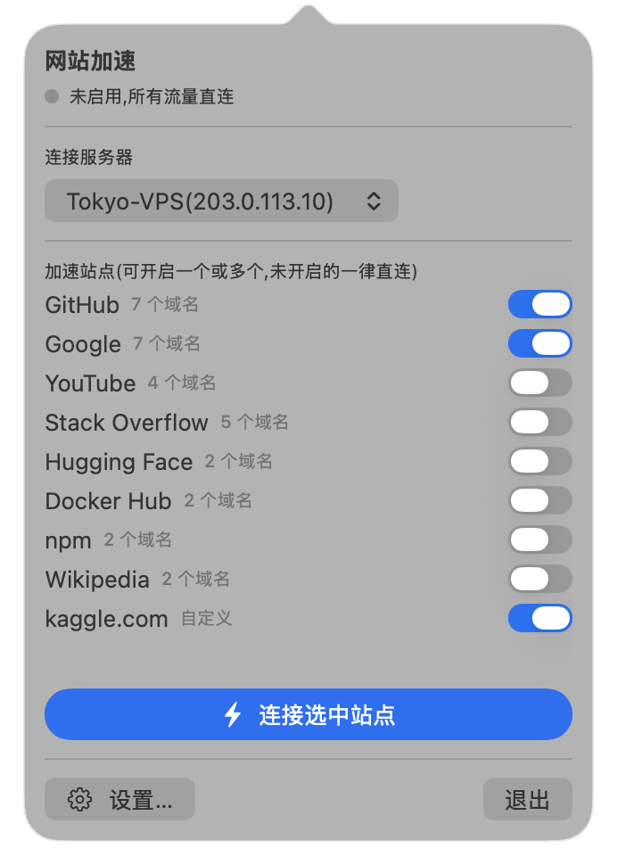
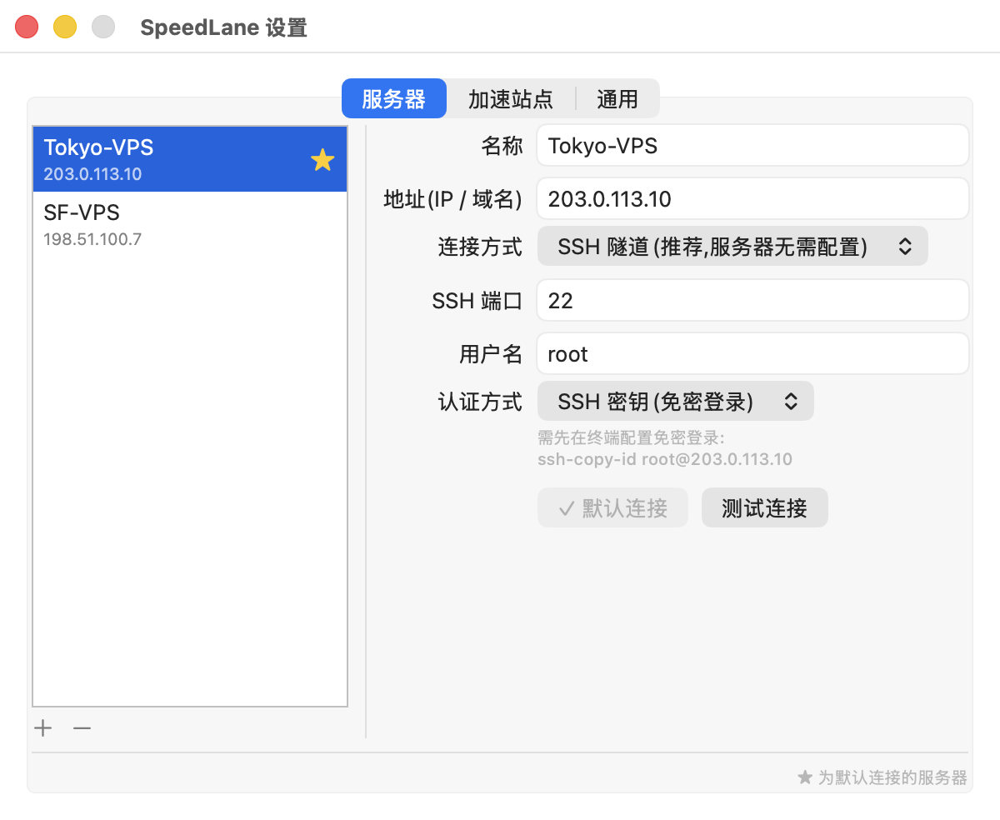

# SpeedLane

> 只给选中的网站开一条快车道 —— macOS / Windows 分流加速工具

[](#系统要求)
[](Package.swift)
[](windows/SpeedLane.Win.csproj)
[](LICENSE)

SpeedLane 通过你**自己的境外服务器**加速访问 GitHub、Google 等指定网站,而其他所有网站保持直连、完全不经过代理。没有订阅、没有第三方节点、没有全局翻墙 —— 一台能 SSH 登录的 VPS 就够了。

<p align="center">
  
  &nbsp;&nbsp;
  
</p>

## 特性

- ⚡ **白名单分流**:基于 PAC 自动代理,只有你开启的站点走加速,其余流量一律直连
- 🖥 **服务器零配置**:默认用 SSH 动态端口转发(`ssh -D`)建立加密隧道,服务器上不需要安装任何软件;也支持连接服务器上已有的 SOCKS5 / HTTP 代理
- 🗂 **多服务器管理**:可添加多台服务器,一键切换默认连接,支持密码(存 macOS 钥匙串)和 SSH 密钥两种登录方式,内置连接测试
- ✅ **站点开关自由组合**:内置 ChatGPT、Claude、Gemini、Perplexity、Grok、GitHub(含 Copilot)、Go 模块代理、Kubernetes 镜像、crates.io、VS Code 插件市场、Vercel、Google、YouTube、Reddit、Discord、X、Medium、Stack Overflow、Hugging Face、Docker Hub、npm、Wikipedia、Udemy、Internet Archive 等预设(含相关 CDN 域名),支持添加自定义域名,每个站点独立滑块开关
- 🗃 **两层分组**:站点按"AI 助手 / 开发工具 / Google 服务 / 社区 / 资料 / 自定义站点"分组,每组可一键全开或全关,组内站点仍可单独控制
- ✏️ **域名可查看可编辑**:设置里点开任意站点即可看到它包含的域名,预设域名可以增删(随时可恢复默认),自定义站点支持"一个名称对应多个域名"
- 🤖 **ChatGPT / Claude 桌面版可用**:桌面客户端走系统代理,打开对应开关后即与网页版一样加速
- 📊 **实时流量显示**:菜单栏图标旁显示当前速率(定宽显示,如 ` 98K`、`1.2M`),空闲时显示 `0`,鼠标悬停可看上下行明细与本次累计;不想要这个数字可在"通用"设置里关掉
- 🧾 **连接日志**:设置里的"日志"标签页逐条列出时间、访问的域名、上下行流量与状态;日志只保留在内存中,最多 500 条,退出即清,不写入任何文件
- 🧰 **git 命令行加速**:自动按域名为 git 配置代理,只影响所选域名的 clone/push
- 🖱 **右键快捷菜单**:右键点击菜单栏图标可快速连接/断开、打开设置、切换开机自动运行
- 🚀 **开机自动运行 + 启动后自动连接**:两者配合实现无感使用
- 🧹 **干净退出**:关闭开关或退出 App 自动还原系统代理设置

## 工作原理

```
浏览器 / 系统 ──> PAC 自动代理判断
                   ├─ 命中开启的域名 ──> 本地中继 (127.0.0.1:1080) ──> SSH 加密隧道 ──> 你的服务器 ──> 目标网站
                   │                        └ 统计流量、记录访问的域名
                   └─ 其他所有域名 ──> 直连(不经过任何代理)
```

1. 开启后 App 运行 `ssh -N -D <端口> user@your-server` 建立加密隧道
2. App 自己在 `127.0.0.1:1080` 起一个 SOCKS5 中继,夹在浏览器和隧道之间,流量统计与连接日志都来自这里
3. 本地起一个只监听 `127.0.0.1` 的微型 HTTP 服务,向系统提供按你的站点选择动态生成的 PAC 文件
4. 通过 `networksetup` 把系统"自动代理配置"指向该 PAC;修改站点选择即时生效
5. 关闭/退出时自动恢复原有网络设置

> 选择"服务器上的 HTTP 代理"模式时,浏览器直接与该代理通信、不经过本地中继,因此没有流量统计和日志。SSH 隧道与 SOCKS5 模式都有。

## 系统要求

- **macOS** 13 (Ventura) 及以上;构建需要 Xcode / Swift 5.9+
- **Windows** 10 及以上(需自带 OpenSSH 客户端,Win10 1809+ 默认包含);构建需要 .NET 8 SDK
- 一台境外 VPS(任意可 SSH 登录的 Linux 服务器即可)

## 安装(macOS)

### 方式一:下载 DMG(推荐)

从 [Releases](https://github.com/openzirun/SpeedLane/releases) 下载最新的 `SpeedLane-x.x.x.dmg`,打开后把 SpeedLane 拖入 Applications 文件夹。

> **首次打开提示"无法验证开发者"或"已损坏"?**
> 项目未购买 Apple 开发者证书,系统会拦截来自网络的未签名应用。任选其一解除:
> - 右键点击 App → 打开 → 再点"打开";或
> - 终端执行 `xattr -cr /Applications/SpeedLane.app` 后正常双击打开

### 方式二:源码构建

```bash
git clone https://github.com/openzirun/SpeedLane.git
cd SpeedLane
./build_app.sh          # 打包出 dist/SpeedLane.app
./make_dmg.sh           # (可选)生成 DMG
open dist/SpeedLane.app
```

想直接跑起来试功能,用 `./run.sh`:一条命令完成编译、打包、启动,并自动弹出主面板和设置窗口。

```bash
./run.sh                # 编译并启动
./run.sh --backup       # 启动前先备份配置,随便折腾后可 --restore 还原
./run.sh --stop         # 停止实例、还原系统代理、清理残留隧道
```

Windows 上对应 `.\windows\run.ps1`(PowerShell 中运行,`-Stop` / `-Backup` / `-Restore` 同理)。

## 安装(Windows)

从 [Releases](https://github.com/openzirun/SpeedLane/releases) 下载 `SpeedLane-win-x64-x.x.x.zip`,解压后运行 `SpeedLane.exe`,图标出现在系统托盘。

- 右键托盘图标:选择服务器、勾选加速站点、连接/断开、设置、开机自动运行
- 双击托盘图标打开设置窗口
- 首次运行如遇 SmartScreen 提示,点"更多信息 → 仍要运行"(未购买代码签名证书)
- 系统代理通过注册表 PAC 设置(对 Edge/Chrome 等使用系统代理的浏览器生效),退出时自动还原
- 密码使用 Windows DPAPI 加密存储,仅当前用户可解密
- 提示:Windows 10 自带的 OpenSSH 较旧(8.1),密码登录依赖的 `SSH_ASKPASS_REQUIRE` 需要 8.4+;如密码登录失败,请改用 SSH 密钥,或升级 OpenSSH

源码构建:

```powershell
dotnet publish windows/SpeedLane.Win.csproj -c Release -r win-x64 --self-contained true -p:PublishSingleFile=true
```

## 使用

1. 点击菜单栏 ⚡ 图标 → **设置…** → "服务器"标签页,添加你的服务器(IP、SSH 端口、用户名、密码或密钥),可用"测试连接"验证,★ 为默认连接
2. 在"加速站点"标签页或菜单弹窗中,用滑块开启要加速的站点(每个分组右侧的"全开 / 全关"可批量操作);设置里点击站点名可展开查看和增删域名,也可以添加自定义站点(名称 + 一个或多个域名)
3. 点击 **连接选中站点**,状态变绿即生效
4. 右键菜单栏图标可快速连接/断开、打开设置、开启"开机自动运行";"通用"设置里还可开启"启动后自动连接"

**登录方式二选一:**

- **密码**:直接在设置中填写,保存在 macOS 钥匙串(经 SSH_ASKPASS 传递,不出现在命令行参数和配置文件中)
- **SSH 密钥**:先在终端执行一次 `ssh-copy-id user@your-server-ip`

## FAQ

**ChatGPT / Claude 桌面版怎么用?**
在 SpeedLane 里打开"AI 助手"组里对应的开关并连接即可,桌面客户端读取的是系统代理设置,不需要在客户端里做任何配置。注意桌面客户端启动时读取一次代理配置,如果连接 SpeedLane 时客户端已经在运行,请退出客户端后重新打开。Gemini 登录依赖 Google 账号,所以 Gemini 预设已包含 accounts.google.com 等必需域名。

**菜单栏的数字代表什么?**
当前这一秒经过加速的流量速率,上下行合计,没有流量时显示 `0`。数字固定占 3 位加一个单位(B / K / M / G),宽度不会来回跳。鼠标悬停可以看到上下行分别是多少以及本次连接的累计量。只有 SSH 隧道和 SOCKS5 模式有这个数字;在"设置 → 通用 → 菜单栏显示实时流量"里可以关掉,关掉后日志和统计照常工作。

**日志里为什么有些记录显示的是 IP 而不是域名?**
取决于发起请求的程序。浏览器通过 PAC 使用 SOCKS5 时会把域名交给代理,所以能看到域名;有些命令行工具会先自己解析 DNS 再连接,那种情况代理只拿得到 IP。

**浏览器生效了,终端里 curl 却不走代理?**
命令行工具不读系统 PAC。git 已自动覆盖(连接时按所选域名配置);其他工具可临时 `export https_proxy=socks5://127.0.0.1:1080`(该终端所有请求都会走代理,用完 `unset`)。

**App 异常退出后网络设置残留?**
系统设置 → Wi-Fi → 详细信息 → 代理,关闭"自动代理配置";或执行 `networksetup -setautoproxystate Wi-Fi off`。

**为什么每次重新编译后读取钥匙串会弹授权框?**
本地构建使用 ad-hoc 签名,二进制指纹每次变化。点"始终允许"即可;正式分发版本使用固定的 Developer ID 签名则无此问题。

**连接失败显示红色?**
常见原因:密码错误、SSH 密钥未配置、服务器防火墙未放行 SSH 端口。用设置里的"测试连接"可看到具体错误信息。

## 项目结构

| 文件 | 职责 |
|------|------|
| [Models.swift](Sources/SpeedLane/Models.swift) | 站点预设、服务器模型、设置持久化 |
| [SSHTunnel.swift](Sources/SpeedLane/SSHTunnel.swift) | SSH 动态转发进程管理、连接测试 |
| [SOCKS5Relay.swift](Sources/SpeedLane/SOCKS5Relay.swift) | 本地 SOCKS5 中继,流量统计与域名记录的来源 |
| [TrafficMonitor.swift](Sources/SpeedLane/TrafficMonitor.swift) | 速率采样与连接日志(仅内存) |
| [PACServer.swift](Sources/SpeedLane/PACServer.swift) | 本地 PAC 服务与 PAC 脚本生成 |
| [SystemProxy.swift](Sources/SpeedLane/SystemProxy.swift) | 系统代理(networksetup)开关 |
| [KeychainStore.swift](Sources/SpeedLane/KeychainStore.swift) | 服务器密码钥匙串存取 |
| [GitProxy.swift](Sources/SpeedLane/GitProxy.swift) | git 按域名代理配置 |
| [AppController.swift](Sources/SpeedLane/AppController.swift) | 总控制流程 |
| [StatusBarController.swift](Sources/SpeedLane/StatusBarController.swift) | 菜单栏图标、左键弹窗/右键菜单 |
| [MenuView.swift](Sources/SpeedLane/MenuView.swift) / [SettingsView.swift](Sources/SpeedLane/SettingsView.swift) | 菜单栏弹窗与设置窗口 |
| [LaunchAtLogin.swift](Sources/SpeedLane/LaunchAtLogin.swift) | 开机自动运行(SMAppService) |
| [windows/](windows/) | Windows 版(C# / .NET 8 WinForms 托盘应用,功能对等) |

## 免责声明

SpeedLane 是一个连接**用户自有服务器**的网络工具,面向开发者访问开发资源(代码托管、包镜像、技术文档)的场景。本项目不提供任何服务器、节点或网络服务。请遵守你所在国家/地区的法律法规,使用本工具产生的一切后果由使用者自行承担。

## License

[MIT](LICENSE)
